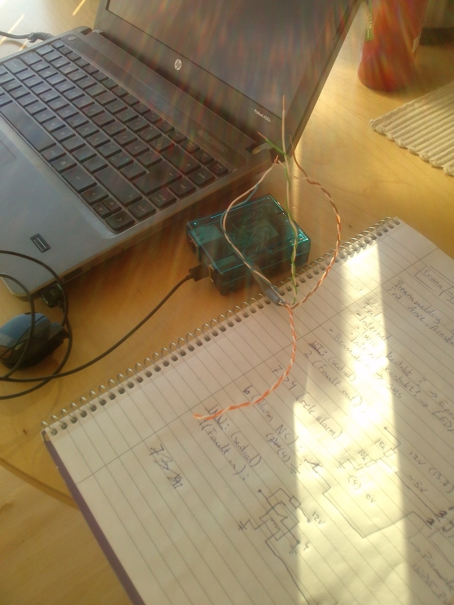
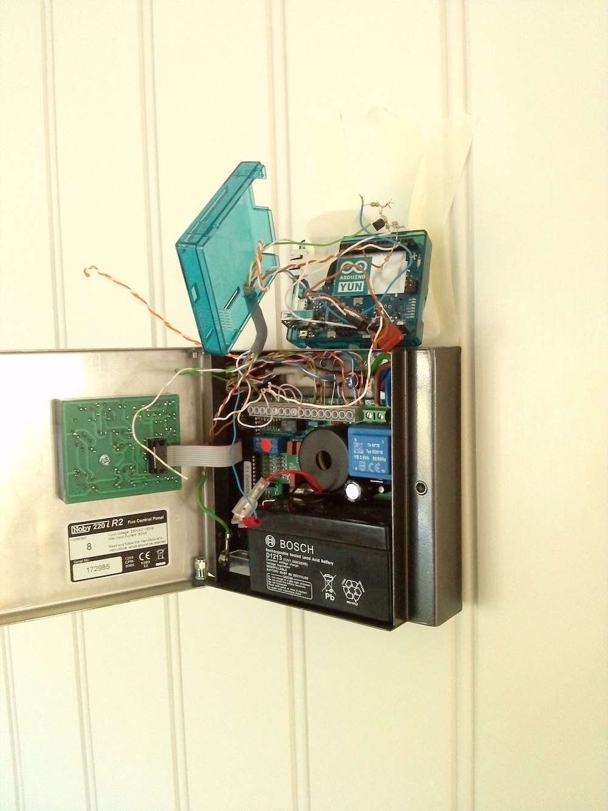

yun-fire-alert
==============

SMS alert for Nobi 220i R2 fire alarm with Arduino Yun


# Install #

## Requirements
MsTimer2 arduino library:
```
git clone https://github.com/PaulStoffregen/MsTimer2 ~/Documents/Arduino/libraries/MsTimer2
```

## Setup
Get code, edit Twilio settings and upload to Yun.
```
git clone https://github.com/arve0/yun-fire-alert.git
cd yun-fire-alert
open sms_alert.py
scp sms_alert.py check_twilio.py cacert.pem root@arduino.local:/
```

Login to YUN through SSH and install twilio:
```
ssh -l root arduino.local
opkg update
opkg install python-openssl python-expat distribute
easy_install twilio
```

Make sure 32u4 is restarted when linux is booted:
```
sed -i "" "s/^#reset-mcu/reset-mcu/" /etc/rc.local
```


# Images #

## Drawing


## Programming


## First live test

